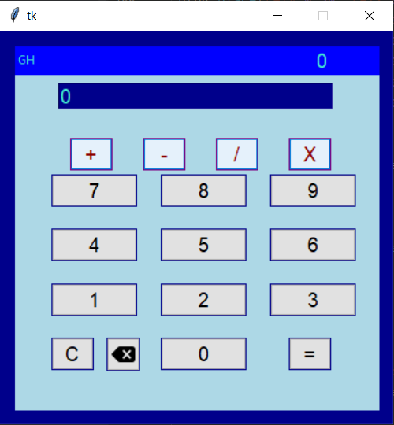

# calculator-py
Calculator With UI, writed with Pyhton.

Codes:

> import tkinter as tk

> from tkinter import messagebox

> from tkinter import ttk

> ana = tk.Tk()

> ana.geometry("400x400")

> ana.resizable(False, False)

> ana.configure(background='darkblue')

> frame = tk.Frame(ana, height=370, width=370, background='lightblue')

> frame.place(relx=0.04,rely=0.04)

def zero():

    size = resultEntry.get()
    if resultEntry.get() == "0":
        resultEntry.delete(0,1)
        
    resultEntry.insert(len(size), "0")
    if resultEntry.get().__contains__("+") or resultEntry.get().__contains__("-") or resultEntry.get().__contains__(
            "*") or resultEntry.get().__contains__("/"):
        disableButtons()

def one():

    size = resultEntry.get()
    if resultEntry.get() == "0":
        resultEntry.delete(0,1)
    resultEntry.insert(len(size), "1")
    if resultEntry.get().__contains__("+") or resultEntry.get().__contains__("-") or resultEntry.get().__contains__(
            "*") or resultEntry.get().__contains__("/"):
        disableButtons()

def two():

    size = resultEntry.get()
    if resultEntry.get() == "0":
        resultEntry.delete(0, 1)
    resultEntry.insert(len(size), "2")
    if resultEntry.get().__contains__("+") or resultEntry.get().__contains__("-") or resultEntry.get().__contains__(
            "*") or resultEntry.get().__contains__("/"):
        disableButtons()

def three():

    size = resultEntry.get()
    if resultEntry.get() == "0":
        resultEntry.delete(0, 1)
    resultEntry.insert(len(size), "3")
    if resultEntry.get().__contains__("+") or resultEntry.get().__contains__("-") or resultEntry.get().__contains__(
            "*") or resultEntry.get().__contains__("/"):
        disableButtons()

def four():

    size = resultEntry.get()
    if resultEntry.get() == "0":
        resultEntry.delete(0, 1)
    resultEntry.insert(len(size), "4")
    if resultEntry.get().__contains__("+") or resultEntry.get().__contains__("-") or resultEntry.get().__contains__(
            "*") or resultEntry.get().__contains__("/"):
        disableButtons()

def five():

    size = resultEntry.get()
    if resultEntry.get() == "0":
        resultEntry.delete(0, 1)
    resultEntry.insert(len(size), "5")
    if resultEntry.get().__contains__("+") or resultEntry.get().__contains__("-") or resultEntry.get().__contains__(
            "*") or resultEntry.get().__contains__("/"):
        disableButtons()

def six():

    size = resultEntry.get()
    if resultEntry.get() == "0":
        resultEntry.delete(0, 1)
    resultEntry.insert(len(size), "6")
    if resultEntry.get().__contains__("+") or resultEntry.get().__contains__("-") or resultEntry.get().__contains__(
            "*") or resultEntry.get().__contains__("/"):
        disableButtons()

def seven():

    size = resultEntry.get()
    if resultEntry.get() == "0":
        resultEntry.delete(0, 1)
    resultEntry.insert(len(size), "7")
    if resultEntry.get().__contains__("+") or resultEntry.get().__contains__("-") or resultEntry.get().__contains__(
            "*") or resultEntry.get().__contains__("/"):
        disableButtons()

def eight():

    size = resultEntry.get()
    if resultEntry.get() == "0":
        resultEntry.delete(0, 1)
    resultEntry.insert(len(size), "8")
    if resultEntry.get().__contains__("+") or resultEntry.get().__contains__("-") or resultEntry.get().__contains__(
            "*") or resultEntry.get().__contains__("/"):
        disableButtons()

def nine():

    size = resultEntry.get()
    if resultEntry.get() == "0":
        resultEntry.delete(0, 1)
    resultEntry.insert(len(size), "9")
    if resultEntry.get().__contains__("+") or resultEntry.get().__contains__("-") or resultEntry.get().__contains__(
            "*") or resultEntry.get().__contains__("/"):
        disableButtons()

def plus():

    size = resultEntry.get()
    resultEntry.insert(len(size), "+")
    disableButtons()

def minus():

    size = resultEntry.get()
    resultEntry.insert(len(size), "-")
    disableButtons()

def divorce():

    size = resultEntry.get()
    resultEntry.insert(len(size), "/")
    disableButtons()

def cross():

    size = resultEntry.get()
    resultEntry.insert(len(size), "*")
    disableButtons()

def reverse():

    if not resultEntry.get() == "0":
        resultEntry.delete(len(resultEntry.get())-1, len(resultEntry.get()))
    if not resultEntry.get().__contains__("+") or not resultEntry.get().__contains__("-") or not resultEntry.get().__contains__(
            "*") or not resultEntry.get().__contains__("/"):
        enableButtons()
    if resultEntry.get() == "":
        resultEntry.insert(0,"0")

def disableButtons():

    btn_minus.configure(state='disabled')
    btn_divorce.configure(state='disabled')
    btn_plus.configure(state='disabled')
    btn_cross.configure(state='disabled')

def enableButtons():

    btn_minus.configure(state='active')
    btn_divorce.configure(state='active')
    btn_plus.configure(state='active')
    btn_cross.configure(state='active')

def clear():

    resultEntry.delete(0, len(resultEntry.get()))
    resultEntry.insert(0,"0")

def get_result():

    global result
    asked = resultEntry.get()
    sliding = 0.03
    try:
        if asked.__contains__("+"):
            ifPlus = asked.split("+")
            plusFirst = float(ifPlus[0])
            plusSecond = float(ifPlus[1])
            result = plusFirst + plusSecond
            resultEntry.delete(0, len(resultEntry.get()))
            resultEntry.insert(0, round(result, 2).__str__())
            if len(result.__str__()) >= 20:
                messagebox.showwarning("Çok Büyük Sonuç", "Sonuç ekrana sığmıyor...")
            elif len(result.__str__()) > 0 and len(result.__str__()) < 20:
                labelResult.configure(text=f"= {round(result, 2)}")
                print(len(result.__str__()))
                sliding = sliding * len(round(result, 2).__str__())
                relX = 0.85 - sliding
                labelResult.place(relx=relX)

            enableButtons()
        elif asked.__contains__("-") and (not asked.__contains__("/") and not asked.__contains__("*")):
            ifMinus = asked.split("-")
            minusFirst = float(ifMinus[0])
            minusSecond = float(ifMinus[1])
            result = minusFirst - minusSecond
            resultEntry.delete(0, len(resultEntry.get()))
            resultEntry.insert(0, round(result, 2).__str__())
            if len(result.__str__()) >= 20:
                messagebox.showwarning("Çok Büyük Sonuç", "Sonuç ekrana sığmıyor...")
            elif len(result.__str__()) > 0 and len(result.__str__()) < 20:
                labelResult.configure(text=f"= {round(result, 2)}")
                print(len(result.__str__()))
                sliding = sliding * len(round(result, 2).__str__())
                relX = 0.85 - sliding
                labelResult.place(relx=relX)
            enableButtons()
        elif asked.__contains__("*"):
            ifCross = asked.split("*")
            crossFirst = float(ifCross[0])
            crossSecond = float(ifCross[1])
            result = crossFirst * crossSecond
            resultEntry.delete(0, len(resultEntry.get()))
            resultEntry.insert(0, round(result, 2).__str__())
            if len(result.__str__()) >= 20:
                messagebox.showwarning("Çok Büyük Sonuç", "Sonuç ekrana sığmıyor...")
            elif len(result.__str__()) > 0 and len(result.__str__()) < 20:
                labelResult.configure(text=f"= {round(result, 2)}")
                print(len(result.__str__()))
                sliding = sliding * len(round(result, 2).__str__())
                relX = 0.85 - sliding
                labelResult.place(relx=relX)
            enableButtons()
        elif asked.__contains__("/"):
            ifDivorce = asked.split("/")
            divorceFirst = float(ifDivorce[0])
            divorceSecond = float(ifDivorce[1])
            result = divorceFirst / divorceSecond
            labelResult.configure(text=f"{round(result, 2)}")
            resultEntry.delete(0, len(resultEntry.get()))
            resultEntry.insert(0, round(result, 2).__str__())
            if len(result.__str__()) >= 20:
                messagebox.showwarning("Çok Büyük Sonuç", "Sonuç ekrana sığmıyor...")
            elif len(result.__str__()) > 0 and len(result.__str__()) < 20:
                labelResult.configure(text=f"= {round(result, 2)}")
                print(len(result.__str__()))
                sliding = sliding * len(round(result, 2).__str__())
                relX = 0.85 - sliding
                labelResult.place(relx=relX)
            enableButtons()

    except:
        messagebox.showerror("İstediğiniz İşlemi Yapamıyoruz :(",
                                 "Lütfen işlemlerinizi teker teker yapınız. \nÖrn: 42+548\nYanlış kullanım Örn: 36+25*9-4")
        enableButtons()

> frameResult = tk.Frame(frame, height=29, width=500 , background='blue')

> frameResult.place(relx=0,rely=0)

> labelResult = tk.Label(frame, text="0",font=80, fg="turquoise", background='blue')

> labelResult.place(relx=0.82, rely=0)

> labelGH = tk.Label(frameResult,text="GH", background='blue', fg='turquoise')

> labelGH.place(rely=0.1, relx=0)

# creating buttons
> btn1 = ttk.Button(frame, text="1", width=7, command=one)

> btn2 = ttk.Button(frame, text="2", width=7, command=two)

> btn3 = ttk.Button(frame, text="3", width=7, command=three)

> btn4 = ttk.Button(frame, text="4", width=7, command=four)

> btn5 = ttk.Button(frame, text="5", width=7, command=five)

> btn6 = ttk.Button(frame, text="6", width=7, command=six)

> btn7 = ttk.Button(frame, text="7", width=7, command=seven)

> btn8 = ttk.Button(frame, text="8", width=7, command=eight)

> btn9 = ttk.Button(frame, text="9", width=7, command=nine)

> btn0 = ttk.Button(frame, text="0", width=7, command=zero)

> btn_plus = ttk.Button(frame, text="+", width=3, command=plus)

> btn_minus = ttk.Button(frame, text="-", width=3, command=minus)

> btn_divorce = ttk.Button(frame, text="/", width=3, command=divorce)

> btn_cross = ttk.Button(frame, text="X", width=3, command=cross)

> btn_equals = ttk.Button(frame, text="=", width=3, command=get_result)

> btn_reverse = ttk.Button(frame, text="←" ,width=3, command=reverse)

> btn_clear = ttk.Button(frame, text='C', command=clear, width=3)

# placing buttons
> btn_plus.place(rely=0.25,relx=0.15)

> btn_minus.place(rely=0.25,relx=0.35)

> btn_divorce.place(rely=0.25,relx=0.55)

> btn_cross.place(rely=0.25,relx=0.75)

> btn_equals.place(rely=0.8,relx=0.75)

> btn_reverse.place(rely=0.8,relx=0.25)

> btn_clear.place(rely=0.8,relx=0.1)

> btn0.place(rely=0.8, relx=0.4)

> btn1.place(rely=0.65, relx=0.1)

> btn2.place(rely=0.65, relx=0.4)

> btn3.place(rely=0.65, relx=0.7)

> btn4.place(rely=0.50, relx=0.1)

> btn5.place(rely=0.50, relx=0.4)

> btn6.place(rely=0.50, relx=0.7)

> btn7.place(rely=0.35, relx=0.1)

> btn8.place(rely=0.35, relx=0.4)

> btn9.place(rely=0.35, relx=0.7)

> resultEntry = tk.Entry(frame,width=25, font=30, background='darkblue', foreground='turquoise')

> resultEntry.place(rely=0.1, relx=0.12)

> resultEntry.insert(0,"0")

if resultEntry.get().__contains__("+") or resultEntry.get().__contains__("-") or resultEntry.get().__contains__("*") or resultEntry.get().__contains__("/"):

    disableButtons()
else: 

    enableButtons()

> style = ttk.Style(ana)

> style.configure('TButton', font=('Helvetica'), background=('darkblue'))

> style.map('TButton', foreground= [('pressed', 'purple'), ('active', 'darkred')], background= [('pressed', 'lightblue'), ('active', 'purple')])

> style.theme_use('vista')

> tk.mainloop()
